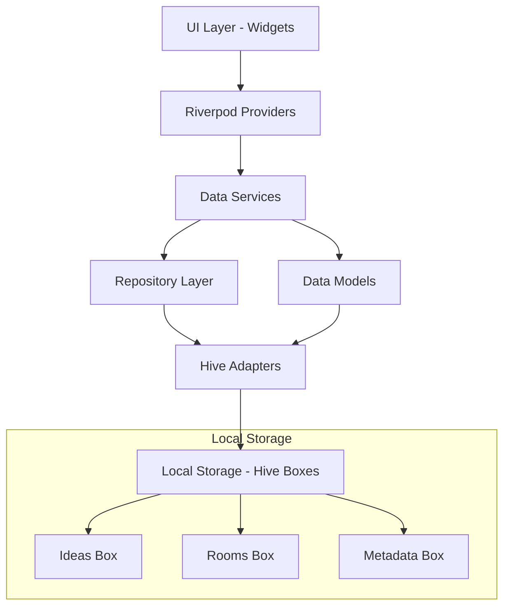
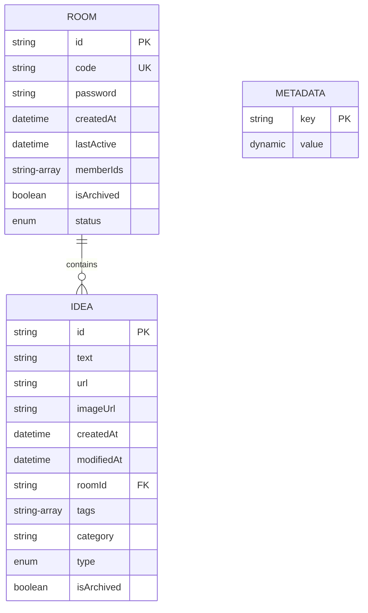

# Design Document

## Overview

The Local Data Persistence System implements offline-first data storage using Hive as the primary local database. The system provides a clean abstraction layer between the UI and data storage, supporting CRUD operations for ideas and rooms while preparing for future real-time synchronization capabilities. The design follows Flutter best practices with Riverpod for state management and includes proper error handling, data validation, and performance optimization.

## Architecture

### High-Level Architecture



### Data Flow

1. **Write Operations**: UI → Provider → Service → Repository → Hive Box
2. **Read Operations**: Hive Box → Repository → Service → Provider → UI
3. **State Management**: Riverpod providers maintain reactive state synchronized with local storage

## Components and Interfaces

### 1. Data Models

#### Enhanced Idea Model
```dart
@HiveType(typeId: 0)
class Idea extends HiveObject {
  @HiveField(0)
  final String id;
  
  @HiveField(1)
  final String? text;
  
  @HiveField(2)
  final String? url;
  
  @HiveField(3)
  final String? imageUrl;
  
  @HiveField(4)
  final DateTime createdAt;
  
  @HiveField(5)
  final DateTime modifiedAt;
  
  @HiveField(6)
  final String? roomId;
  
  @HiveField(7)
  final List<String> tags;
  
  @HiveField(8)
  final String? category;
  
  @HiveField(9)
  final IdeaType type;
  
  @HiveField(10)
  final bool isArchived;
}
```

#### Enhanced Room Model
```dart
@HiveType(typeId: 1)
class Room extends HiveObject {
  @HiveField(0)
  final String id;
  
  @HiveField(1)
  final String code;
  
  @HiveField(2)
  final String? password;
  
  @HiveField(3)
  final DateTime createdAt;
  
  @HiveField(4)
  final DateTime lastActive;
  
  @HiveField(5)
  final List<String> memberIds;
  
  @HiveField(6)
  final bool isArchived;
  
  @HiveField(7)
  final RoomStatus status;
}
```

### 2. Repository Layer

#### IdeaRepository Interface
```dart
abstract class IdeaRepository {
  Future<List<Idea>> getAllIdeas();
  Future<Idea?> getIdeaById(String id);
  Future<List<Idea>> getIdeasByRoom(String roomId);
  Future<List<Idea>> searchIdeas(String query);
  Future<void> saveIdea(Idea idea);
  Future<void> updateIdea(Idea idea);
  Future<void> deleteIdea(String id);
  Future<void> archiveIdea(String id);
  Stream<List<Idea>> watchAllIdeas();
}
```

#### RoomRepository Interface
```dart
abstract class RoomRepository {
  Future<List<Room>> getAllRooms();
  Future<Room?> getRoomById(String id);
  Future<Room?> getRoomByCode(String code);
  Future<void> saveRoom(Room room);
  Future<void> updateRoom(Room room);
  Future<void> deleteRoom(String id);
  Future<void> archiveExpiredRooms();
  Stream<List<Room>> watchAllRooms();
}
```

### 3. Service Layer

#### IdeaService
- Handles business logic for idea operations
- Manages data validation and transformation
- Coordinates between repositories and providers
- Implements search and filtering logic

#### RoomService
- Manages room lifecycle and operations
- Handles room code generation and validation
- Implements room expiration logic
- Manages member operations

### 4. Database Manager

#### HiveManager
```dart
class HiveManager {
  static const String ideasBoxName = 'ideas';
  static const String roomsBoxName = 'rooms';
  static const String metadataBoxName = 'metadata';
  
  Future<void> initialize();
  Future<void> registerAdapters();
  Future<Box<T>> openBox<T>(String boxName);
  Future<void> closeAllBoxes();
  Future<void> clearAllData();
  Future<Map<String, dynamic>> exportData();
  Future<void> importData(Map<String, dynamic> data);
}
```

## Data Models

### Storage Schema

#### Ideas Box Structure
- **Key**: String (UUID)
- **Value**: Idea object with full metadata
- **Indexes**: createdAt, modifiedAt, roomId, type, tags

#### Rooms Box Structure
- **Key**: String (UUID)
- **Value**: Room object with member information
- **Indexes**: code, lastActive, status

#### Metadata Box Structure
- **Key**: String (configuration keys)
- **Value**: Dynamic (app settings, sync metadata)

### Data Relationships



## Error Handling

### Error Types
1. **StorageException**: Database operation failures
2. **ValidationException**: Data validation errors
3. **CorruptionException**: Database corruption issues
4. **MigrationException**: Schema migration failures

### Error Recovery Strategies
- **Automatic Retry**: For transient storage failures
- **Data Validation**: Input sanitization and validation
- **Backup Recovery**: Restore from backup on corruption
- **Graceful Degradation**: Continue with limited functionality

### Error Logging
- Structured logging with error context
- Performance metrics tracking
- User-friendly error messages
- Debug information for development

## Testing Strategy

### Unit Tests
- **Model Tests**: Serialization/deserialization validation
- **Repository Tests**: CRUD operations and edge cases
- **Service Tests**: Business logic and data transformation
- **Provider Tests**: State management and reactivity

### Integration Tests
- **Database Operations**: End-to-end storage workflows
- **Migration Tests**: Schema version upgrades
- **Performance Tests**: Large dataset operations
- **Backup/Restore Tests**: Data export/import functionality

### Test Data Management
- **Mock Data Generation**: Realistic test datasets
- **Database Isolation**: Separate test databases
- **Cleanup Procedures**: Test data cleanup after runs
- **Performance Benchmarks**: Response time validation

## Performance Considerations

### Optimization Strategies
1. **Lazy Loading**: Load data on-demand for large datasets
2. **Indexing**: Efficient queries with proper indexes
3. **Batch Operations**: Group multiple operations for efficiency
4. **Memory Management**: Proper disposal of resources
5. **Background Processing**: Non-blocking operations for UI

### Caching Strategy
- **In-Memory Cache**: Frequently accessed data
- **Query Result Cache**: Complex search results
- **Metadata Cache**: App configuration and settings
- **Cache Invalidation**: Automatic cache updates on data changes

### Monitoring
- **Query Performance**: Track slow operations
- **Memory Usage**: Monitor memory consumption
- **Storage Size**: Track database growth
- **Error Rates**: Monitor failure frequencies

## Migration and Versioning

### Schema Versioning
- **Version Tracking**: Database schema version management
- **Migration Scripts**: Automated schema updates
- **Backward Compatibility**: Support for older data formats
- **Rollback Capability**: Revert problematic migrations

### Data Migration Process
1. **Backup Current Data**: Create safety backup
2. **Run Migration Scripts**: Apply schema changes
3. **Validate Data Integrity**: Verify migration success
4. **Update Version Metadata**: Record new schema version
5. **Cleanup Old Data**: Remove obsolete data structures

## Security Considerations

### Data Protection
- **Local Encryption**: Sensitive data encryption at rest
- **Password Security**: Secure room password storage
- **Data Sanitization**: Input validation and sanitization
- **Access Control**: Proper data access permissions

### Privacy Compliance
- **Data Minimization**: Store only necessary data
- **User Consent**: Clear data usage policies
- **Data Retention**: Automatic cleanup of old data
- **Export Rights**: User data export capabilities