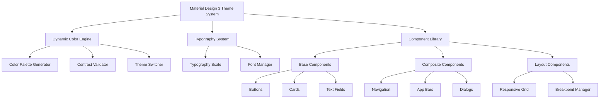

# Material Design 3 UI System Design

## Overview

The Material Design 3 UI system provides a comprehensive Flutter implementation of Google's Material Design 3 (Material You) design system for the Idea Sharing app. This system creates a cohesive, accessible, and modern user interface that adapts to user preferences while maintaining consistency across all application components.

The design follows a layered architecture approach:
- **Theme Layer**: Manages color schemes, typography, and design tokens
- **Component Layer**: Provides reusable UI components following MD3 specifications
- **Layout Layer**: Handles responsive design and screen adaptations
- **Animation Layer**: Implements motion design and transitions

## Architecture

### System Architecture



### Design Decisions

**1. Flutter Material 3 Integration**
- Rationale: Leverage Flutter's built-in Material 3 support for consistency and performance
- Implementation: Extend ThemeData with custom Material 3 configurations
- Benefits: Automatic platform integration and reduced development overhead

**2. Dynamic Color Architecture**
- Rationale: Support both system-level dynamic colors and fallback static palettes
- Implementation: Color extraction service with graceful degradation
- Benefits: Personalized experience while maintaining accessibility

**3. Token-Based Design System**
- Rationale: Ensure consistency and maintainability across components
- Implementation: Centralized design token management with semantic naming
- Benefits: Easy theming updates and consistent visual language

## Components and Interfaces

### Core Theme Interface

```dart
abstract class MaterialDesign3Theme {
  ColorScheme get colorScheme;
  TextTheme get textTheme;
  ThemeData get themeData;
  
  void updateDynamicColors(ColorScheme? dynamicColors);
  void toggleDarkMode();
  bool get isDarkMode;
}
```

### Dynamic Color Service

```dart
abstract class DynamicColorService {
  Future<ColorScheme?> extractColorsFromWallpaper();
  ColorScheme generateFallbackColorScheme();
  bool get isDynamicColorSupported;
  Stream<ColorScheme> get colorSchemeUpdates;
}
```

### Component System Architecture

**Base Component Structure:**
- All components extend a base `MD3Component` class
- Consistent state management (normal, pressed, focused, disabled)
- Built-in accessibility support
- Responsive behavior integration

**Component Categories:**

1. **Foundational Components**
   - Buttons (Filled, Outlined, Text, Icon)
   - Cards (Elevated, Filled, Outlined)
   - Chips (Input, Filter, Action, Suggestion)
   - Text Fields (Filled, Outlined)

2. **Navigation Components**
   - Navigation Bar
   - Navigation Rail
   - Navigation Drawer
   - Tab Bar

3. **Layout Components**
   - App Bar (Top, Bottom)
   - Floating Action Button
   - Snackbar
   - Dialog (Basic, Full-screen)

### Responsive Design System

**Breakpoint Strategy:**
- Compact: 0-599dp (phones in portrait)
- Medium: 600-839dp (tablets in portrait, phones in landscape)
- Expanded: 840dp+ (tablets in landscape, desktops)

**Layout Adaptation:**
- Component density adjustments
- Navigation pattern switching (bottom nav → rail → drawer)
- Content layout optimization

## Data Models

### Color System Model

```dart
class MD3ColorSystem {
  final ColorScheme lightColorScheme;
  final ColorScheme darkColorScheme;
  final bool isDynamicColorEnabled;
  final ColorScheme? dynamicLightScheme;
  final ColorScheme? dynamicDarkScheme;
  
  // Tonal palette implementation
  final TonalPalette primaryPalette;
  final TonalPalette secondaryPalette;
  final TonalPalette tertiaryPalette;
  final TonalPalette neutralPalette;
  final TonalPalette neutralVariantPalette;
  final TonalPalette errorPalette;
}
```

### Typography System Model

```dart
class MD3Typography {
  // Display styles
  final TextStyle displayLarge;
  final TextStyle displayMedium;
  final TextStyle displaySmall;
  
  // Headline styles
  final TextStyle headlineLarge;
  final TextStyle headlineMedium;
  final TextStyle headlineSmall;
  
  // Title styles
  final TextStyle titleLarge;
  final TextStyle titleMedium;
  final TextStyle titleSmall;
  
  // Body styles
  final TextStyle bodyLarge;
  final TextStyle bodyMedium;
  final TextStyle bodySmall;
  
  // Label styles
  final TextStyle labelLarge;
  final TextStyle labelMedium;
  final TextStyle labelSmall;
}
```

### Component State Model

```dart
enum MD3ComponentState {
  enabled,
  disabled,
  pressed,
  focused,
  hovered,
  dragged,
}

class MD3ComponentStateColors {
  final Color enabled;
  final Color disabled;
  final Color pressed;
  final Color focused;
  final Color hovered;
  
  Color getColorForState(MD3ComponentState state) {
    // State-specific color logic
  }
}
```

## Error Handling

### Color System Error Handling

**Dynamic Color Failures:**
- Graceful fallback to static Material 3 color schemes
- Error logging for debugging dynamic color extraction issues
- User notification for dynamic color unavailability (optional)

**Contrast Validation:**
- Automatic contrast ratio checking for all color combinations
- Fallback color selection when contrast requirements aren't met
- Accessibility warnings in debug mode

### Component Error Handling

**Theme Application Errors:**
- Default theme fallback when custom themes fail to load
- Component-level error boundaries to prevent cascade failures
- Graceful degradation for unsupported features

**Responsive Layout Errors:**
- Safe area handling for unusual screen configurations
- Fallback layouts for unsupported breakpoints
- Orientation change error recovery

## Testing Strategy

### Unit Testing

**Color System Testing:**
- Tonal palette generation accuracy
- Contrast ratio calculations
- Dynamic color extraction (mocked)
- Theme switching functionality

**Component Testing:**
- State management verification
- Accessibility property validation
- Responsive behavior testing
- Animation completion testing

### Integration Testing

**Theme Integration:**
- End-to-end theme application
- Dynamic color system integration
- Cross-component consistency validation

**Accessibility Testing:**
- Screen reader compatibility
- Touch target size validation
- Color contrast verification
- Keyboard navigation testing

### Visual Regression Testing

**Component Consistency:**
- Screenshot comparison testing for all components
- Theme variation validation
- Responsive layout verification
- Animation frame testing

### Performance Testing

**Theme Performance:**
- Theme switching performance benchmarks
- Color calculation optimization validation
- Memory usage monitoring for color palettes

**Animation Performance:**
- Frame rate monitoring during transitions
- Animation smoothness validation
- Reduced motion preference testing

## Implementation Phases

### Phase 1: Foundation
- Core theme system implementation
- Basic color scheme management
- Typography system setup
- Base component architecture

### Phase 2: Dynamic Colors
- Dynamic color extraction service
- Tonal palette generation
- Contrast validation system
- Theme switching mechanisms

### Phase 3: Component Library
- Foundational components implementation
- State management integration
- Accessibility features
- Basic animations

### Phase 4: Advanced Features
- Navigation components
- Complex layout components
- Advanced animations
- Responsive design system

### Phase 5: Polish & Optimization
- Performance optimization
- Visual polish
- Comprehensive testing
- Documentation completion

## Accessibility Considerations

**Color Accessibility:**
- WCAG 2.1 AA contrast compliance
- Color-blind friendly palette generation
- High contrast mode support

**Interaction Accessibility:**
- Minimum 48dp touch targets
- Screen reader semantic labels
- Keyboard navigation support
- Focus management

**Motion Accessibility:**
- Reduced motion preference respect
- Alternative feedback for motion-sensitive users
- Configurable animation settings